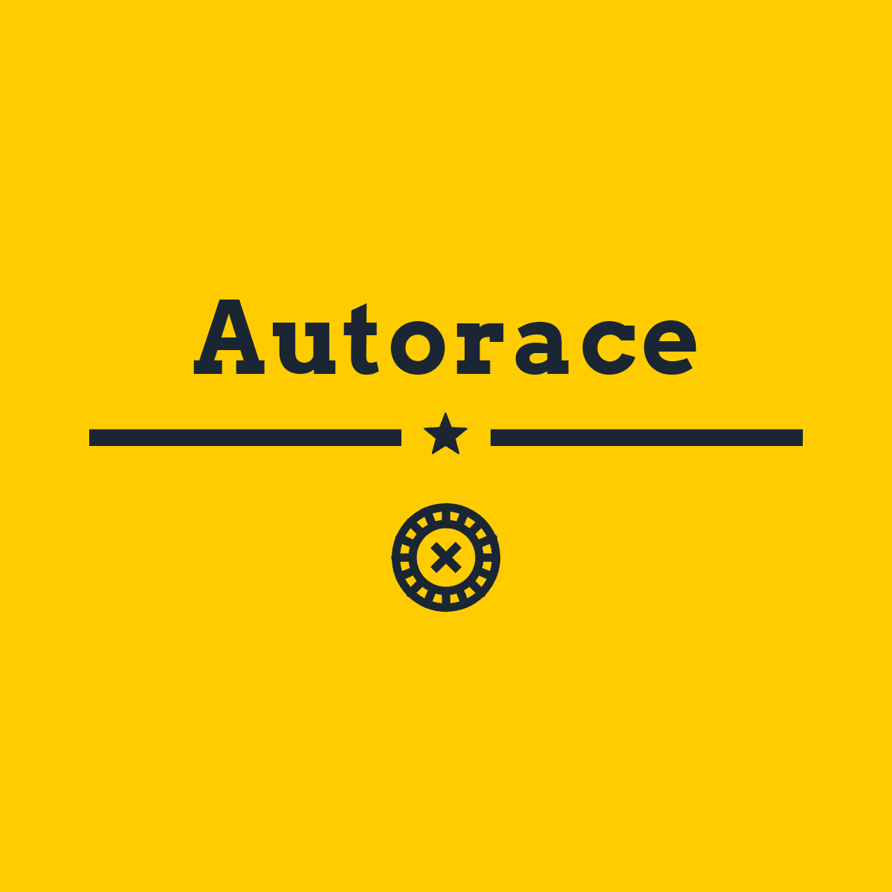

[![LinkedIn][linkedin-shield]][linkedin-url]


<!-- PROJECT LOGO -->
<br />
<p align="center">
  <a href="https://github.com/clnbs/autorace">
    
  </a>

  <h3 align="center">Autorace</h3>

  <p align="center">
    Autorace is a personal project of a multiplayer 2D racing game designed to be fully scalable.
    <br />
    <br />
    <a href="https://github.com/clnbs/autorace/issues">Report Bug</a>
    ·
    <a href="https://github.com/clnbs/autorace/issues">Request Feature</a>
  </p>
</p>


<!-- TABLE OF CONTENTS -->
## Table of Contents

* [About the Project](#about-the-project)
  * [Built With](#built-with)
* [Getting Started](#getting-started)
  * [Prerequisites](#prerequisites)
    * [Memory usage and configuration](#memory-usage-and-configuration)
  * [Server side installation](#server-side-installation)
  * [Client side installation](#client-side-installation)
    * [Linux systems](#Linux-systems)
    * [Windows systems](#windows-systems)
* [Usage](#usage)
  * [Server side](#server-side)
    * [Deployment](#deployment)
    * [Monitoring](#monitoring)
  * [Client side](#client-side)
    * [Join or create a party](#join-or-create-a-party)
    * [main game command](#main-game-command)
* [Under the hood](#under-the-hood)
  * [Philosophy](#philosophy)
  * [General repository layout](#general-repository-layout)
  * [Autorace logic](#autorace-logic)
  * [Foreign components](#foreign-components)
* [Roadmap](#roadmap)
* [Contributing](#contributing)
* [License](#license)
* [Contact](#contact)
* [Acknowledgements](#acknowledgements)


<!-- ABOUT THE PROJECT -->
## About The Project

![Product Name Screen Shot][product-screenshot]

__*This project is still in a prototype stage.*__

Autorace is a personal project of a multiplayer 2D racing game designed to be fully scalable.

Is it over-engineered ? Totally. Is it, at least, a good game? No. This project was built to show and extends my programming skills because I am currently looking for a job. You can find my résumé [here](https://github.com/clnbs/resume).


### Built With

* [Pixel](https://github.com/faiface/pixel) - 2D game library in Go
* [RabbitMQ](https://www.rabbitmq.com/) - Messages broker
* [Go mod](https://blog.golang.org/using-go-modules) - Dependency Management
* [Google UUID](https://github.com/google/uuid) - UUID creation
* [Fluentd](https://www.fluentd.org/) - Logs centralisation
* [Elasticsearch](https://www.elastic.co/elasticsearch/) - Logs storage
* [Kibana](https://www.elastic.co/kibana) - Logs visualization
* [Redis](https://redis.io/) - Cache and short termed storage
* [Hatchful](https://hatchful.shopify.com/) - Logo creation


<!-- GETTING STARTED -->
## Getting Started

DISCLAIMER: this project is still under heavy development. You should not run Autorace in a production environment.

### Prerequisites

In order to compile and run the server stack, you will need :
 - A Debian based Linux operating system (tested on Debian 10)
 - Docker installed. You can find instructions [here](https://docs.docker.com/get-docker/)
 - Git
 
#### Memory usage and configuration
 
In order to compile and run Autorace full stack, you will need 9 GiB of disk space (recommended).
 
 
To make Elasticsearch be able to start in Docker, you have to modify VM heap map allocation bigger:
```
sudo sysctl -w vm.max_map_count=262144
```
 
Alternatively, you can apply this change in `sysctl.conf`:
```
user@host~$ sudo -i
[sudo] password for user: 
root@host~# echo 'vm.max_map_count=262144' >> /etc/sysctl.conf
``` 


### Server side installation

1) Clone this repository
```
mkdir -p $GOPATH/src/github.com/clnbs
cd $GOPATH/src/github.com/clnbs
git clone https://github.com/clnbs/autorace
```

2) Build server 
```
make server
```

3) Build clients
```
make linux
make windows
```

4) Optional - Clean build artifacts
```
make clean
``` 

You can get help with this Makefile
```
make
OR
make help
```

### Client side installation
##### Linux systems
Make sure to have execution right on binary `autorace.bin`. You can easily run a client with the following command line : 
```
./autorace.bin
```

You can download the latest tag version [here](https://github.com/clnbs/autorace/releases).

##### Windows systems
You can run Autorace by double clicking on `autorace.exe`

<!-- USAGE EXAMPLES -->
## Usage
### Server side
#### Deployment
Deploy this project with ease using the Makefile :
- Starting server stack:
```
make run
```

- Clean deployment artifact to terminate demo server stack:
```
make down
``` 


You can get help with this Makefile:
```
make
OR
make help
```

#### Monitoring
When server stack is fully deploy, you can go to the Kibana interface to visualize logs coming from server stack :
1) go to `http://localhost:5601/`
2) click on the menu icon on the top left hand, then on `Dashboard` under `Kibana` section
3) click on `create index pattern`
4) under `index pattern name`, type `logstash*`
5) click on `next step`
6) on `time filed`, select `@timestamp`
7) click on `create index pattern`
8) click on the menu icon on the top left hand, then on `Discover` under `Kibana` section

You can also watch RabbitMQ usage by going to a RabbitMQ interface on `http://localhost:8080/` using default user `guest:guest`.

### Client side
#### Join or create a party
When Autorace is started, it open a prompt window asking for a user name : 
```
Enter your player name : toto
```
You can set what ever who want as user name, then Autorace will ask for a server address : 
```
Enter server address : localhost
```
Enter the server IP address. The prompt menu will then ask you the server port, leave blank to use default port :
```
Enter server port : 
```
The prompt menu will ask if you want to create a party:
```
Do you want to create a game ? (y/n) : 
```
Press `y` or `n` then enter.  

If you are willing to join a created address, a new prompt menu will pop like so :
```
Choose a party from the list below : 
party 1 : f9a43673-82cb-481a-ae25-e5ac25ba8c53
party 2 : 5174687b-2860-4ea2-a933-5a0c46d11881
```
Enter the party numer (`1` or `2` in this case) and the game will start.

#### Main game command
When the game start after a creation or a join, the game will be in `LOBBY` state. Autorace can have four different state :
 - `LOBBY` where people can join the game, when leaved once, no new player can join the game
 - `RUN` when the game is started and player can move their cars
 - `PAUSE` who can be trigger when the game is in `RUN` state
 - `END` when the game has ended

You can start the game in `LOBBY` state by pressing `P` key. You can also pause and resumed the game by also pressing `P` key.

You can move your car with directional key `←`, `→`, `↑` and `↓` 

Since game ranking and winning condition detection are not implemented yet, you can end the game at any moment by pressing `END` key.

Summary :
 - `P` to start, pause and resume the game
 - `←`, `→`, `↑` and `↓` to move around
 - `END` to end game

<!-- UNDER THE HOOD -->
## Under the hood
### Philosophy
Autorace was built with a strong scalability in mind. All components should be easily deployed on any infrastructure. 

### General repository layout
This repository layout follow Go's best practices. You can find documentation [here](https://github.com/golang-standards/project-layout).

### Autorace logic
Autorace got three main developed components :
 - A client who can be compiled for Windows and Linux systems
 - A "static" server who handle player and party management
 - A "dynamic" server who handle game logic
 
At start-up, when the server stack is started and accepting ongoing connection, the client ask for a player creation by giving a pseudonym. Then, a static server instance give back a player object. Once player object received, the client can ask to create or join an ongoing party in lobby state. If the client ask to create a party, the static server create a dynamic server instance, then, this dynamic instance send back to the client an instanced party and will handle all game logic : 
 - adding player to the party
 - handle game state (in a lobby, running, paused or terminated)
 - compute player position while running
 - etc

All game physic are compute server side and sent back to the client who print results.

### Foreign components
The server stack use an EFK (elasticsearch, fluentd, kibana) in order stack to centralize logs from server instances (dynamic and static).

A Redis instance is started, it caches players, parties' configuration and players registered in a particular party.

A RabbitMQ instance is started and make communication possible between clients and servers.   

<!-- ROADMAP -->
## Roadmap

See the [open issues](https://github.com/clnbs/autorace/issues) for a list of proposed features (and known issues).

See the [roadmap](ROADMAP.md) for a list of planned feature 

<!-- CONTRIBUTING -->
## Contributing

Contributions are what make the open source community such an amazing place to be learn, inspire, and create. Any contributions you make are **greatly appreciated**.

1. Fork the Project
2. Create your Feature Branch (`git checkout -b feature/AmazingFeature`)
3. Commit your Changes (`git commit -m 'Add some AmazingFeature'`)
4. Push to the Branch (`git push origin feature/AmazingFeature`)
5. Open a Pull Request


<!-- LICENSE -->
## License

Distributed under the MIT License. See `LICENSE` for more information.


<!-- CONTACT -->
## Contact

Colin Bois - <colin.bois@rocketmail.com>

Project Link: [https://github.com/clnbs/autorace](https://github.com/clnbs/autorace)


<!-- ACKNOWLEDGEMENTS -->
## Acknowledgements

* [StackOverflow](https://stackoverflow.com/) - For their reliable answers and their legendary kindness
* [Gustavo Maciel - Gamasutra](https://www.gamasutra.com/blogs/GustavoMaciel/20131229/207833/Generating_Procedural_Racetracks.php) - For the inspiration


<!-- MARKDOWN LINKS & IMAGES -->
<!-- https://www.markdownguide.org/basic-syntax/#reference-style-links -->
[issues-url]: https://github.com/clnbs/repo/issues
[license-shield]: https://img.shields.io/github/license/clnbs/repo.svg?style=flat-square
[license-url]: https://github.com/clnbs/repo/blob/master/LICENSE
[linkedin-shield]: https://img.shields.io/badge/-LinkedIn-black.svg?style=flat-square&logo=linkedin&colorB=555
[linkedin-url]: https://www.linkedin.com/in/colin-bois-a5b673105/
[product-screenshot]: assets/screenshot/autorace_2020-10-15_19-00-23.png